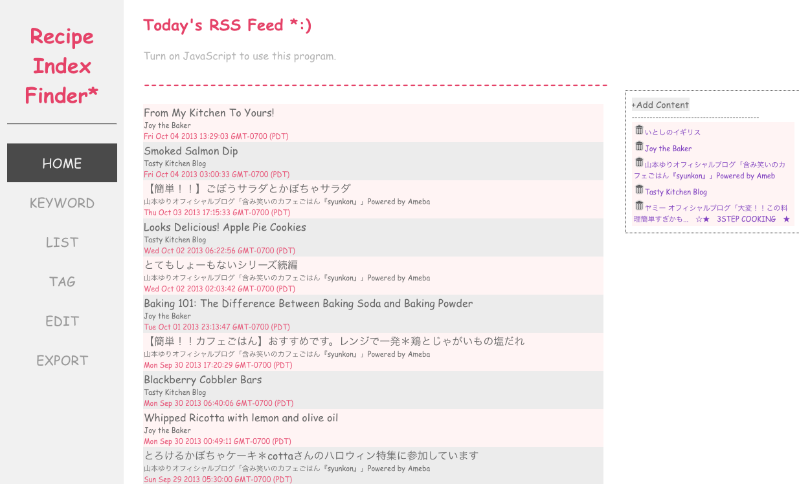

Recipe Index Finder
=================
#Description#
This is the search engine based on web application for searching the recipe index.
The application has 3 features: search, manage, and RSS feed.
As for search, it supports multiple ways to find the recipe index: tag search, keyword search, and the list of all tag and recipe.   
As for manage, it makes the data management easy from the web page: add, delete, modify, and export data.
In the home page, there is RSS feeds from favorite website or homepage (only support xml 2.0). Be able to (un)subscribe from the page.

#Table Schema#  
CONTENTS
```
recipeid INT NOT NULL,
ingredients TEXT,
instructions TEXT,
PRIMARY KEY(recipeid)
```
RECIPE
```
recipeid INT NOT NULL
name VARCHAR(50) NOT NULL
resource VARCHAR(50)
resourcelink VARCHAR(200)
PRIMARY KEY(recipeid)
```
RECIPETAG
```
recipeid INT NOT NULL
tagid VARCHAR(10) NOT NULL
```
RSS WEB SITE
```
siteid   VARCHAR(10) NOT NULL
sitename VARCHAR(50) 
sitexml  TEXT NOT NULL
siteurl  MEDIUMTEXT NOT NULL
PRIMARY KEY(siteid)
```
TAG
```
tagid VARCHAR(10) NOT NULL
name VARCHAR(30)
PRIMARY KEY(tagid)
```
#Screenshot#


