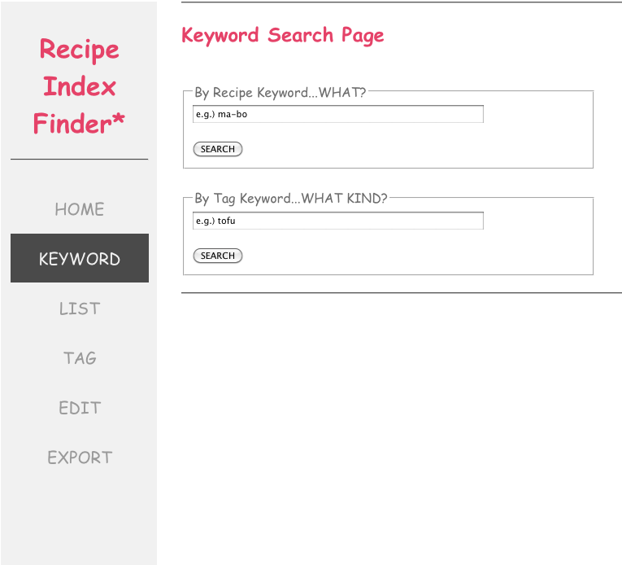
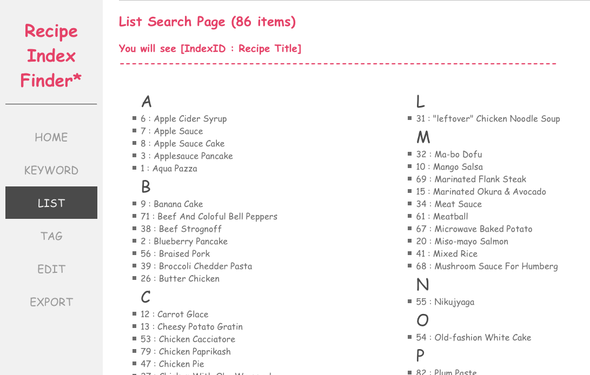
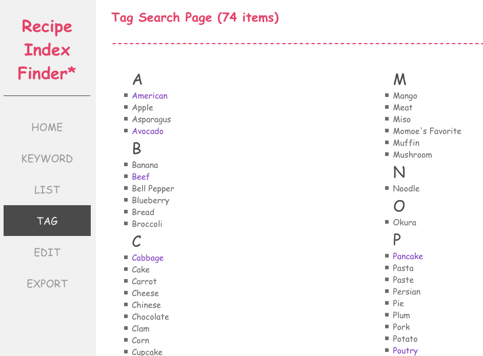
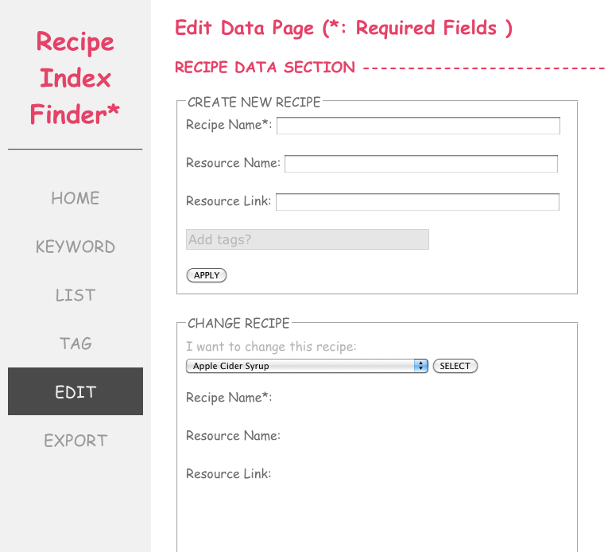
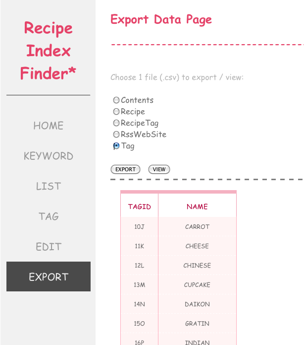

Recipe Index Finder
=================
Description
--------------
This is a search engine for recipe indexes. I print my recipies on Index Cards and number them. 
It is difficult to keep track of the ordering, so I wrote this simple database to more easily locate a specific recipe. 

The application has 3 features: search data, manage data, and view RSS feeds. As for the searching, it supports multiple ways to find a recipe's index: 
tag or keyword search, and a list of all tags and recipes. As for managing data, add, delete, modify, and export is supported.
In the home page, you can view RSS feeds from favorite recipe websites (only xml 2.0 is supported currently). Also, able to subscribe and unsubscribe the RSS feeds.

Tools and Languages
--------------
MAMP (Apache, MySQL, PHP), JavaScript, jQuery, AJAX, and HTML/CSS

Table Schema  
--------------
CONTENTS
```
recipeid INT NOT NULL,
ingredients TEXT,
instructions TEXT,
PRIMARY KEY(recipeid)
```
RECIPE
```
recipeid INT NOT NULL
name VARCHAR(50) NOT NULL
resource VARCHAR(50)
resourcelink VARCHAR(200)
PRIMARY KEY(recipeid)
```
RECIPETAG
```
recipeid INT NOT NULL
tagid VARCHAR(10) NOT NULL
```
RSS WEB SITE
```
siteid   VARCHAR(10) NOT NULL
sitename VARCHAR(50) 
sitexml  TEXT NOT NULL
siteurl  MEDIUMTEXT NOT NULL
PRIMARY KEY(siteid)
```
TAG
```
tagid VARCHAR(10) NOT NULL
name VARCHAR(30)
PRIMARY KEY(tagid)
```
Screenshot
--------------








